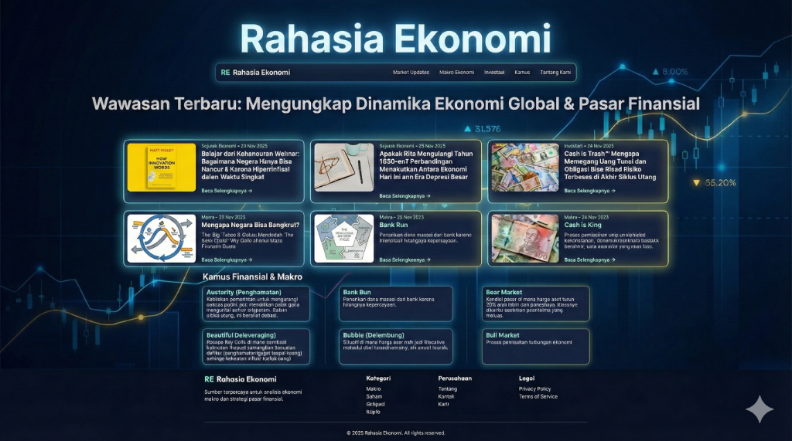

# Rahasia Ekonomi

**Rahasia Ekonomi** adalah platform edukasi finansial dan makroekonomi yang dirancang untuk memberikan wawasan mendalam tentang dinamika ekonomi global, siklus utang, dan sejarah ekonomi. Proyek ini bertujuan untuk membantu pembaca memahami mekanisme ekonomi yang kompleks melalui artikel yang mudah dipahami dan visualisasi yang menarik.



## Fitur Utama

*   **Artikel Mendalam:** Analisis komprehensif tentang topik-topik seperti "The Big Cycle" Ray Dalio, krisis utang, dan sejarah hiperinflasi.
*   **Kamus Finansial & Makro:** Referensi cepat untuk istilah-istilah ekonomi dan investasi yang sering membingungkan.
*   **Visualisasi Data:** Grafik dan ilustrasi (seperti siklus utang) untuk mempermudah pemahaman konsep abstrak.
*   **Desain Responsif:** Tampilan yang optimal di berbagai perangkat, dari desktop hingga ponsel.

## Teknologi yang Digunakan

Proyek ini dibangun menggunakan teknologi web standar yang ringan dan cepat:

*   **HTML5:** Struktur semantik untuk konten web.
*   **CSS3:** Styling kustom dengan desain modern, dark mode, dan efek glassmorphism.
*   **Vanilla JavaScript:** Logika interaktif tanpa ketergantungan pada framework berat, memastikan performa maksimal.

## Cara Menjalankan

1.  Clone repositori ini:
    ```bash
    git clone https://github.com/adisabhista/rahasia_ekonomi.git
    ```
2.  Buka folder proyek.
3.  Buka file `index.html` di browser pilihan Anda.

## Lisensi

Proyek ini dibuat untuk tujuan edukasi. Hak cipta konten artikel merujuk pada referensi yang tercantum (misalnya karya Ray Dalio).
